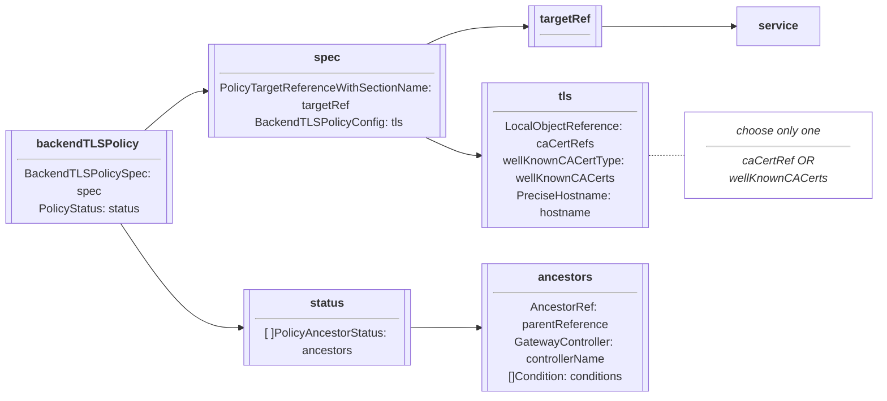
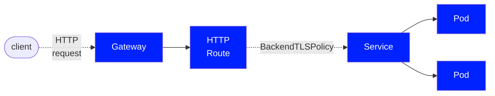

<!-- TRANSLATED by md-translate -->
# BackendTLSPolicy

例如 "V1.0.0+ 版本中的实验频道"。

```
The `BackendTLSPolicy` resource is Alpha and part of the Experimental Channel in `v1.0.0+`.
```

[后端TLSPolicy](/references/spec/#gateway.networking.k8s.io/v1alpha2.BackendTLSPolicy)是一种 gateway API 类型，用于通过服务 API 对象指定从 gateway 到后端 pod/s 连接的 TLS 配置。

## 背景

BackendTLSPolicy "专门针对 TLS 的配置，以便将 HTTPS 从 gateway 数据平面传输到后端。 这被称为 "后端 TLS 终止"，使 gateway 知道如何连接到拥有自己证书的后端 pod。

虽然还有其他 API 对象可用于配置 TLS 的**直通**和**边缘**终止，但本 API 对象允许用户专门配置**后端** TLS 终止。 有关 gateway API 中 TLS 配置的更多信息，请参阅 [TLS 配置](/guides/tls/)。

显示三种 TLS 终止类型的镜像](/images/tls-termination-types.png)

后端TLSPolicy 是直接[PolicyAttachment](/reference/policy-attachment/)，不带默认值或覆盖值，应用于访问后端的服务，其中后端TLSPolicy 与所应用的服务位于同一命名空间。 后端TLSPolicy 和服务必须位于同一命名空间，以防止跨命名空间共享信任所带来的复杂问题。

所有指向引用服务的 gateway API 路由都应遵守已配置的 BackendTLSPolicy。

## Spec

BackendTLSPolicy](/references/spec/#gateway.networking.k8s.io/v1alpha2.BackendTLSPolicy) 的规范由以下内容组成：

* [TargetRef](/references/spec/#gateway.networking.k8s.io/v1alpha2.PolicyTargetReference) - 定义策略的目标 API 对象。  只允许使用服务。
* [TLS](/references/spec/#gateway.networking.k8s.io/v1alpha2.BackendTLSPolicy.TLS) - 定义 TLS 的配置，包括主机名、CACertRefs 和 WellKnownCACerts。
* [Hostname](/references/spec/#gateway.networking.k8s.io/v1beta1.PreciseHostname) - 定义 Gateway 用于连接后端的《服务器名称指示》（SNI）。
* [CACertRefs](/references/spec/#gateway.networking.k8s.io/v1alpha2.BackendTLSPolicyConfig.CACertRefs) - 定义一个或多个包含 PEM 编码 TLS 证书的对象引用、

可以指定 CACertRefs 或 WellKnownCACerts，但不能同时指定。

* [WellKnownCACerts](/references/spec/#gateway.networking.k8s.io/v1alpha2.BackendTLSPolicyConfig.WellKnownCACerts)--指定是否可在 TLS 中引用系统 CA 证书。

可以指定 CACertRefs 或 WellKnownCACerts，但不能同时指定。

下图概述了对象的定义和关系：



下图展示了为服务后端配置 TLS 的 BackendTLSPolicy：



### 目标后端

BackendTLSPolicy 通过 TargetRef 将后端 Pod（或 Pod 集）定位到服务。 TargetRef 是一个必需的对象引用，通过其名称、种类（服务）以及可选的名称空间和组来指定服务。 TargetRef 标识了 HTTPRoute 需要 TLS 的服务。

信息 "限制"

```
- Cross-namespace certificate references are not allowed.
```

### BackendTLSPolicyConfig

BackendTLSPolicyConfig 是 BackendTLSPolicy 的规范，定义了 TLS 的配置，包括主机名（用于服务器名称指示）和证书。

#### 主机名

主机名定义了 gateway 为连接后端而应使用的服务器名称指示（SNI），并且必须与后端 pod 提供的证书相匹配。 主机名是网络主机的完全限定域名，由 [RFC 3986][rfc-3986]定义。 请注意以下与 RFC 中定义的 URI 中 "host "部分的偏差：

* 不允许使用 IP 地址。

另请注意

信息 "限制"

```
- Wildcard hostnames are not allowed.
```

#### 证书

BackendTLSPolicyConfig 必须包含某种证书引用，并包含两种配置后端 TLS 所用证书的方法，即 CACertRefs 和 WellKnownCACerts。 每个 BackendTLSPolicyConfig 只能被引用其中一种。

##### CaCertRefs

CACertRefs 指向一个或多个 PEM 编码的 TLS 证书。

信息 "限制"

```
- Cross-namespace certificate references are not allowed.
```

##### WellKnownCACerts

如果在不需要特定 TLS 证书的环境中工作，且 gateway API 实现允许使用系统或默认证书（如在开发环境中），则可将 WellKnownCACerts 设置为 "系统"，以告诉 gateway 使用一组可信 CA 证书。 每个实现使用的系统证书可能存在一些差异。 更多信息请参考所选实现的文档。

### 政策状态

状态定义了 BackendTLSPolicy 的观察状态，用户不可配置。 检查状态的方法与检查其他 gateway API 对象的方法相同，以验证操作是否正确。 请注意，BackendTLSPolicy 中的状态被引用为 "PolicyAncestorStatus"，以便知道是哪个父引用设置了该特定状态。