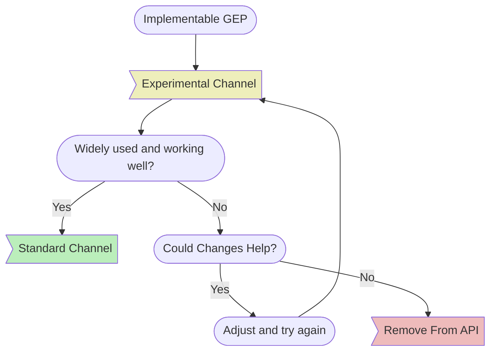

<!-- TRANSLATED by md-translate -->
# 版本

## 概览

gateway API 的每个新发布版本都定义了一个 "捆绑版本"，它代表一个发布版本的 Git 标签，如 v1.0.0。 它包含以下内容：

* API 类型（资源的 Go 绑定）
* CRD（资源的 Kubernetes 定义）

#### 发布渠道

发布通道用于表示 gateway API 中功能的稳定性。 所有新功能和资源都从实验发布通道开始。 从那时起，这些功能和资源可能会升级到标准发布通道，或从 API 中完全删除。

下图提供了 gateway API 中新的 [GEP](/geps/overview/)（增强建议）所建议的功能或资源的生命周期的高层概览：



标准发布通道包括

* 已升级到 Beta 或 GA API 版本的资源（请注意，Gateway API 正在逐步淘汰 Beta API 版本）
* 从实验通道升级到标准通道的所有字段

实验发布通道包括标准发布通道中的所有内容，另外还有

* 具有 Alpha API 版本的资源
* 在升级到标准通道之前的所有新字段

发布通道重叠](/images/release-channel-overlap.svg)

<!-- Source: https://docs.google.com/presentation/d/1sfZTV-vlisDUIie_iK_B2HqKia_querT6m6T2_vbAk0/edit -->

我们建议默认使用标准通道，因为它将提供稳定的体验。 许多实现也提供对实验通道的支持，这使我们能够快速迭代新功能。 请注意，该通道不保证向后兼容性，并且可能在任何时候发布破坏性更改。

###应用程序接口版本

上游 Kubernetes API 有 3 个稳定级别，分别由 alpha、beta 和 GA API 版本表示。 在 gateway API 中，我们将稳定级别缩减为 2 个，由上述发布渠道表示。

一般来说，这意味着当资源从实验频道升级到标准频道时，它们也将从 Alpha API 版本（v1alpha2）升级到 GA API 版本（v1）。

#### 理由

出于以下原因，我们将逐步淘汰测试版：

1. 在大多数情况下，API 的稳定性实际上分为两个级别--默认安装（稳定）和 alpha/实验（不稳定）。对于 gateway API 而言，中间状态（测试版）的价值并不明显。
2. 我们将 "稳定 "和 "实验 "API 分得越远，就越需要更长的时间来获得对新功能有意义的反馈。
3. 我们维护的每个 API 版本都会给用户、实施者和维护者带来巨大的额外成本。

#### Beta

尽管一些 gateway API 资源在升级到标准通道时已经获得了 Beta API 版本，但任何其他资源都不会如此。 所有未来升级到标准通道的资源都将包含一个 v1 API 版本，这也是升级过程的一部分。

已经有测试版 API（v1beta1）的资源有

* HTTPRoute
* Gateway
* 网关类
* 参考授权

在 v1.0 发布版本中，HTTPRoute、Gateway 和 GatewayClass 都升级为包含 GA API 版本（v1）。

ReferenceGrant 是一个特例，因为它正在[过渡为上游 Kubernetes API](https://github.com/kubernetes/enhancements/issues/3766)的过程中，由[sig-auth](https://github.com/kubernetes/community/blob/master/sig-auth/README.md) 所拥有。在解决这个问题之前，ReferenceGrant 很可能会作为测试版冻结在 gateway API 中。当它作为内置 Kubernetes API 广泛可用时，我们很可能会将其从 gateway API 的标准通道中移除。

## 版本指示器

每份 CRD 在发布时都将附上 Annotations，标明其捆绑版本和渠道：

```
gateway.networking.k8s.io/bundle-version: v0.4.0
gateway.networking.k8s.io/channel: standard|experimental
```

## 可以改变什么

在使用或实施此 API 时，必须了解在不同捆绑包版本之间可能发生的变化。

#### 补丁版本（例如 v0.4.0 -&gt; v0.4.1）

* API Spec：
    - 澄清
    - 纠正错别字
* 修正错误：
    - 更正验证
    - 发布流程或工件的修正
* 一致性测试：
    - 现有测试的修正
    - 现有功能的额外一致性测试覆盖范围

#### 次版本（例如 v0.4.0 -&gt; v0.5.0）

* 补丁发布中有效的所有内容
* 实验通道：
    - 添加新的 API 字段或资源
    - 对现有 API 字段或资源进行破坏性更改
    - 删除 API 字段或资源，但不事先废除
* 标准通道：
    - 将字段或资源从实验通道逐步升级到标准通道
    - 按照[Kubernetes 废弃
    政策](https://kubernetes.io/docs/reference/using-api/deprecation-policy/) 后删除 API 资源
* 所有通道：
    - 更改状态中的推荐条件或原因
    - 放松验证（包括将必填字段变为可选字段）
    - 更改一致性测试以匹配规范更新
    - 引入新的 API 版本，其中可能包括重命名字段或
    在[新 Kubernetes API
    版本](https://kubernetes.io/docs/reference/using-api/#api-versioning) 中有效的任何内容。

#### 主要版本（如 v0.x 至 v1.0）

* 当主要版本发生变化时，无法保证应用程序接口的兼容性。

## 毕业标准

资源、字段或功能要从 "试验 "升级到 "标准"，必须满足以下标准：

* 全面的一致性测试覆盖范围。
* 多种符合标准的实现方式。
* 广泛实施和使用。
* 作为 alpha API，至少有 6 个月的浸泡时间。
* 至少 1 个小发布版本和 3 个月内无重大变更。
* 获得子项目 Owners + KEP 审核人员的批准。

## 支持的版本

本项目旨在为各种 Kubernetes 版本提供支持，并在不同版本之间提供一致的升级体验。 为实现这一目标，我们承诺：

1. 至少支持最新的 5 个 Kubernetes 次版本。
2. 确保 v1beta1 和 v1 之间的所有标准通道变更完全兼容和可转换。
3. 尽一切可能避免引入转换 webhook。如果需要引入转换 webhook，将在 API 的整个生命周期内提供支持，或至少在有替代方案之前提供支持。

## CRD 管理

如需了解如何管理集群中的 gateway API CRD，请参阅我们的[CRD 管理指南](/guides/crd-management)。

## 超出范围

### 未发布的应用程序接口

本项目的主分支会经常更新。 在发布之前，包括主分支在内的任何分支中的代码都无法保证兼容性。 例如，在发布版本之前，更改可能会被还原。 为获得最佳效果，请引用本项目最新发布的版本。

#### 源代码

我们不为源代码导入提供稳定性保证。 在未来的任何发布中，接口和行为可能会以意想不到和向后不兼容的方式发生变化。